[README.md](https://github.com/user-attachments/files/32985034/README.md)
# Infraestructura 1: VPN Site-to-Site FortiGate ↔ FortiGate

**Autor:** Omar Paulino · **Matrícula:** 20251325
**Plataforma:** GNS3 · FortiGate VM 7.0.9 · Cisco IOSvL2 · Ubuntu Cloud 24.04

---

## Video de demostración

https://youtu.be/oAHdkiUZZGs?si=y0z8-XKvlGeKGFbf


En el video muestro la topología, la configuración de los dos FortiGate, el túnel IPsec activo y las pruebas desde el Usuario hacia el Servidor Web con la VPN arriba y con la VPN abajo.

---

## Contenido

1. [Propósito de la práctica](#1-propósito-de-la-práctica)
2. [Topología](#2-topología)
3. [Direccionamiento IP](#3-direccionamiento-ip)
4. [Cableado en GNS3](#4-cableado-en-gns3)
5. [Switches](#5-switches)
6. [FortiGate 1 (FW1-1325)](#6-fortigate-1-fw1-1325)
7. [FortiGate 2 (FMW2-1325)](#7-fortigate-2-fmw2-1325)
8. [Webterms de gestión](#8-webterms-de-gestión)
9. [Usuario](#9-usuario)
10. [Servidor Web](#10-servidor-web)
11. [Pruebas y resultados](#11-pruebas-y-resultados)
12. [Problemas que encontré y cómo los resolví](#12-problemas-que-encontré-y-cómo-los-resolví)
13. [Estructura del repositorio](#13-estructura-del-repositorio)

---

## 1. Propósito de la práctica

El objetivo de esta práctica fue **conectar dos sitios remotos de forma segura a través de Internet** usando una **VPN IPsec Site-to-Site entre dos FortiGate**.

- En el **Sitio 1** hay un Usuario dentro de la VLAN 10.
- En el **Sitio 2** hay un Servidor Web con HTTPS.
- El Usuario solo puede llegar al Servidor Web **a través del túnel cifrado**. Si el túnel cae, la comunicación entre los sitios se corta, pero los dos sitios siguen teniendo Internet.

Con esto demuestro que el tráfico entre las dos LAN viaja cifrado por un medio inseguro (el ISP) y que no existe otro camino entre ellas fuera de la VPN.

### Requisitos y cómo los cumplí

| Requisito | Cómo lo cumplí |
| --- | --- |
| Dos FortiGate configurados por GUI | FW1-1325 y FMW2-1325 (FortiOS 7.0.9). Toda la configuración la hice por GUI; solo la IP inicial de gestión fue por CLI |
| Configuraciones de red | Interfaces, VLAN 10, IP secundarias, DNS, ruta por defecto y servidor DHCP |
| NAT | Una política de salida a Internet con NAT en cada FortiGate (`USUARIOS-INTERNET` y `SERVIDOR-INTERNET`) |
| VPN Site-to-Site | Túnel IPsec creado con el **IPsec Wizard** entre las IP públicas simuladas `200.25.13.13` ↔ `200.25.13.25` |
| ISP con IP públicas | Switch IOSvL2-1 conectado a la nube NAT1, con IP públicas simuladas como IP secundarias en la WAN |
| Servidor Web en una /28 con HTTPS | Ubuntu + Apache con SSL en `10.13.25.128/28` (IP `10.13.25.130`) |
| Usuarios en una /25, VLAN 10, DHCP y traceroute | Ubuntu en la VLAN 10 `10.13.25.0/25`, con IP por DHCP del FW1; `traceroute` hasta el servidor |

---

## 2. Topología

### Topología en GNS3

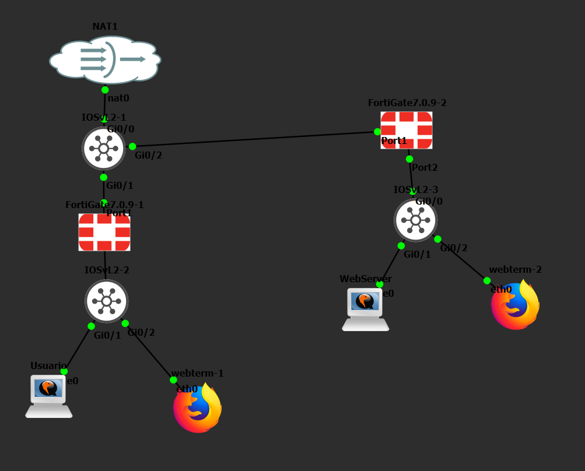

### Diagrama lógico

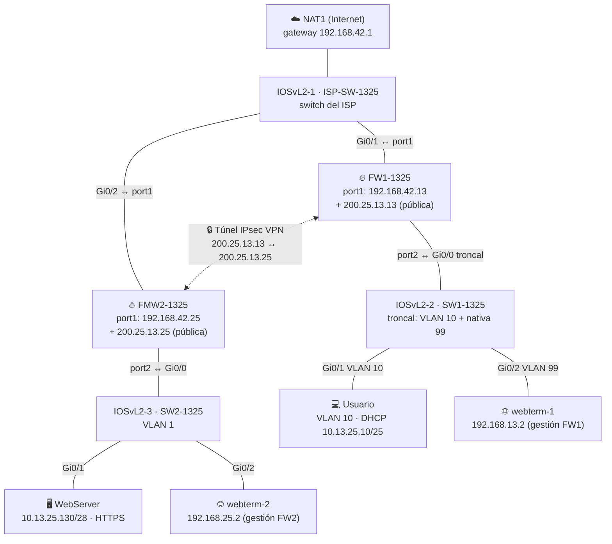
```mermaid
flowchart TB
    NAT1["☁️ NAT1 (Internet)<br/>gateway 192.168.42.1"]
    ISP["IOSvL2-1 · ISP-SW-1325<br/>switch del ISP"]
    FW1["🔥 FW1-1325<br/>port1: 192.168.42.13<br/>+ 200.25.13.13 (pública)"]
    FW2["🔥 FMW2-1325<br/>port1: 192.168.42.25<br/>+ 200.25.13.25 (pública)"]
    SW1["IOSvL2-2 · SW1-1325<br/>troncal: VLAN 10 + nativa 99"]
    SW2["IOSvL2-3 · SW2-1325<br/>VLAN 1"]
    U["💻 Usuario<br/>VLAN 10 · DHCP 10.13.25.10/25"]
    WT1["🌐 webterm-1<br/>192.168.13.2 (gestión FW1)"]
    WS["🖥️ WebServer<br/>10.13.25.130/28 · HTTPS"]
    WT2["🌐 webterm-2<br/>192.168.25.2 (gestión FW2)"]

    NAT1 --- ISP
    ISP ---|Gi0/1 ↔ port1| FW1
    ISP ---|Gi0/2 ↔ port1| FW2
    FW1 <-.->|"🔒 Túnel IPsec VPN<br/>200.25.13.13 ↔ 200.25.13.25"| FW2
    FW1 ---|port2 ↔ Gi0/0 troncal| SW1
    SW1 ---|Gi0/1 VLAN 10| U
    SW1 ---|Gi0/2 VLAN 99| WT1
    FW2 ---|port2 ↔ Gi0/0| SW2
    SW2 ---|Gi0/1| WS
    SW2 ---|Gi0/2| WT2
```

### Flujo del tráfico Usuario → Servidor Web

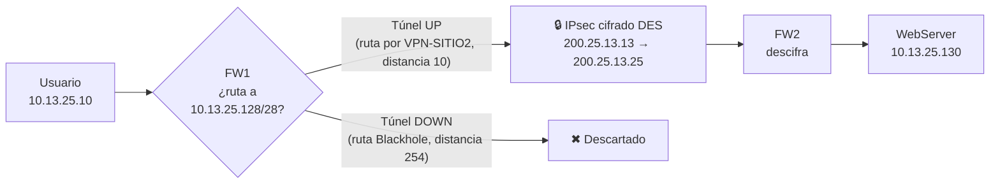
```mermaid
flowchart LR
    U["Usuario<br/>10.13.25.10"] --> FW1{"FW1<br/>¿ruta a<br/>10.13.25.128/28?"}
    FW1 -- "Túnel UP<br/>(ruta por VPN-SITIO2, distancia 10)" --> T["🔒 IPsec cifrado DES<br/>200.25.13.13 → 200.25.13.25"]
    T --> FW2["FW2<br/>descifra"] --> WS["WebServer<br/>10.13.25.130"]
    FW1 -- "Túnel DOWN<br/>(ruta Blackhole, distancia 254)" --> X["✖ Descartado"]
```

### Flujo del tráfico hacia Internet (NAT)

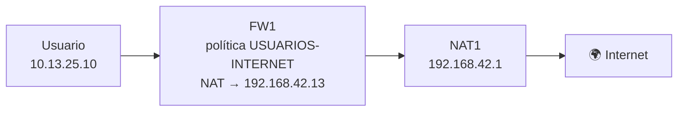
```mermaid
flowchart LR
    U["Usuario<br/>10.13.25.10"] --> FW1["FW1<br/>política USUARIOS-INTERNET<br/>NAT → 192.168.42.13"]
    FW1 --> NAT1["NAT1<br/>192.168.42.1"] --> I["🌍 Internet"]
```

---

## 3. Direccionamiento IP

El direccionamiento lo derivé de mi matrícula **2025-1325**:

- `10.13.25.x` para las LAN.
- `200.25.13.x` para las IP públicas simuladas.
- `.13` y `.25` para identificar cada sitio.

| Segmento | Red | VLAN | Gateway | Equipos |
| --- | --- | --- | --- | --- |
| Usuarios (Sitio 1) | 10.13.25.0/25 | 10 | 10.13.25.1 (FW1) | Usuario por DHCP (rango 10.13.25.10 – 10.13.25.100) |
| Servidor Web (Sitio 2) | 10.13.25.128/28 | sin VLAN | 10.13.25.129 (FW2) | WebServer: 10.13.25.130 |
| IP públicas simuladas (VPN) | 200.25.13.0/27 | — | — | FW1: 200.25.13.13 · FW2: 200.25.13.25 |
| Salida a Internet (NAT1) | 192.168.42.0/24 | — | 192.168.42.1 | FW1: 192.168.42.13 · FW2: 192.168.42.25 |
| Gestión Sitio 1 | 192.168.13.0/24 | 99 (nativa) | 192.168.13.1 (FW1) | webterm-1: 192.168.13.2 |
| Gestión Sitio 2 | 192.168.25.0/24 | sin VLAN | 192.168.25.1 (FW2) | webterm-2: 192.168.25.2 |

### Decisiones de diseño

- **Dos IP en la WAN (`port1`) de cada FortiGate.** La nube NAT1 de GNS3 solo conoce la red `192.168.42.0/24`, así que usé la IP principal `192.168.42.x` para salir a Internet. Como IP secundaria puse la "IP pública" del sitio (`200.25.13.x`), y la VPN la levanté entre esas dos IP públicas. Las dos IP están en el mismo segmento físico (el switch del ISP), por eso los FortiGate se alcanzan entre sí por las `200.25.13.x` sin necesitar un router.
- **Las dos LAN no se solapan.** La `10.13.25.0/25` termina en `.127` y la `10.13.25.128/28` empieza en `.128`. Si se solaparan, la VPN no podría enrutar entre ellas.
- **No creé ninguna ruta manual hacia la LAN del otro sitio.** La única ruta hacia la LAN remota la crea el asistente de VPN y apunta a la interfaz del túnel. Sin túnel no hay camino entre los sitios.
- **El Sitio 2 no usa VLAN.** La red de gestión (`192.168.25.0/24`) y la del servidor (`10.13.25.128/28`) comparten `port2`: una como IP principal y la otra como IP secundaria.
- **Clave precompartida (PSK) de la VPN:** `Vpn#20251325`.

---

## 4. Cableado en GNS3

| Desde | Puerto | Hasta | Puerto |
| --- | --- | --- | --- |
| NAT1 | nat0 | IOSvL2-1 (ISP-SW-1325) | Gi0/0 |
| IOSvL2-1 | Gi0/1 | FortiGate7.0.9-1 (FW1-1325) | port1 |
| IOSvL2-1 | Gi0/2 | FortiGate7.0.9-2 (FMW2-1325) | port1 |
| FW1-1325 | port2 | IOSvL2-2 (SW1-1325) | Gi0/0 |
| IOSvL2-2 | Gi0/1 | Usuario | e0 (ens3) |
| IOSvL2-2 | Gi0/2 | webterm-1 | eth0 |
| FMW2-1325 | port2 | IOSvL2-3 (SW2-1325) | Gi0/0 |
| IOSvL2-3 | Gi0/1 | WebServer | e0 (ens3) |
| IOSvL2-3 | Gi0/2 | webterm-2 | eth0 |

---

## 5. Switches

Configuré los tres switches por CLI desde la consola de GNS3. Los comandos exactos están en [`scripts/switches/`](VPN-Infraestructura-1-FortiGate-FortiGate/scripts/switches/) y los running-configs en [`running-configs/`](VPN-Infraestructura-1-FortiGate-FortiGate/running-configs/).

### 5.1 IOSvL2-1: ISP-SW-1325 (simula el ISP)

Es un switch de capa 2 que une la nube NAT1 con la WAN de los dos FortiGate. Todos los puertos son de acceso en la VLAN 1.

| Puerto | Descripción | Modo |
| --- | --- | --- |
| Gi0/0 | Hacia NAT1 (Internet) | access |
| Gi0/1 | Hacia FW1 port1 (WAN) | access + portfast edge |
| Gi0/2 | Hacia FW2 port1 (WAN) | access + portfast edge |

### 5.2 IOSvL2-2: SW1-1325 (Sitio 1)

| Puerto | Descripción | Modo | VLAN |
| --- | --- | --- | --- |
| Gi0/0 | Troncal hacia FW1 port2 | trunk dot1q, nonegotiate | permitidas 10,99 · nativa 99 |
| Gi0/1 | Usuario | access + portfast edge | 10 (USUARIOS) |
| Gi0/2 | webterm-1 (gestión) | access + portfast edge | 99 (GESTION) |

- La **VLAN 99** viaja **sin etiqueta** (nativa), así el FortiGate la recibe directamente en `port2`, donde está la IP de gestión `192.168.13.1`.
- La **VLAN 10** viaja **etiquetada** y llega a la subinterfaz `VLAN10` del FortiGate.
- Usé `switchport nonegotiate` para apagar DTP, porque el FortiGate no lo usa.

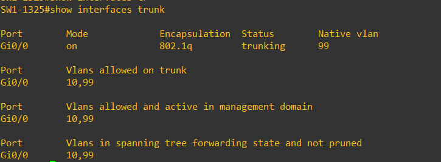

### 5.3 IOSvL2-3: SW2-1325 (Sitio 2)

| Puerto | Descripción | Modo |
| --- | --- | --- |
| Gi0/0 | Hacia FW2 port2 | access + portfast edge |
| Gi0/1 | WebServer | access + portfast edge |
| Gi0/2 | webterm-2 (gestión) | access + portfast edge |

---

## 6. FortiGate 1 (FW1-1325)

> 📝 **Nota:** toda la configuración de esta sección la hice **de forma gráfica (GUI)** desde el Firefox del webterm-1, entrando a `http://192.168.13.1`. El único paso por CLI fue darle la IP inicial a `port2`. El running-config completo en texto está en [`running-configs/FW1-1325.conf`](VPN-Infraestructura-1-FortiGate-FortiGate/running-configs/FW1-1325.conf).

### 6.1 Arranque inicial por CLI

Entré por consola con `admin` y la contraseña vacía; el equipo me obligó a crear una contraseña nueva. Después le di IP a `port2` para poder entrar a la GUI:

```
config system interface
    edit "port2"
        set mode static
        set ip 192.168.13.1 255.255.255.0
        set allowaccess ping https http
    next
end
```

### 6.2 System → Settings

| Campo | Valor |
| --- | --- |
| Hostname | `FW1-1325` |
| Time zone | GMT-4 (Santo Domingo) |

### 6.3 Network → Interfaces

| Interfaz | Alias | Tipo | Rol | IP principal | IP secundaria | Administrative Access |
| --- | --- | --- | --- | --- | --- | --- |
| port1 | WAN-ISP | Física | WAN | 192.168.42.13/24 | 200.25.13.13/27 (PING) | PING |
| port2 | GESTION | Física | LAN | 192.168.13.1/24 | — | PING, HTTPS, HTTP |
| VLAN10 | USUARIOS | VLAN 802.1Q sobre port2, ID 10 | LAN | 10.13.25.1/25 | — | PING |
| VPN-SITIO2 | — | Túnel (la creó el asistente) | — | 0.0.0.0 (sin IP) | — | ninguno |

En la WAN dejé solo PING para no exponer la administración del FortiGate hacia el ISP. Al crear la VLAN10 dejé activada la opción **Create address object matching subnet**, que creó el objeto `VLAN10 address`.

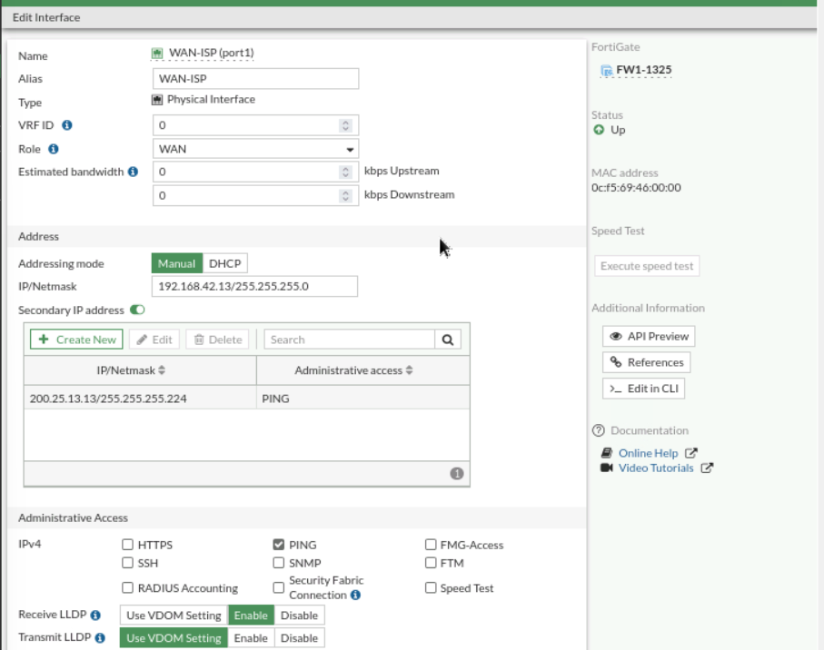
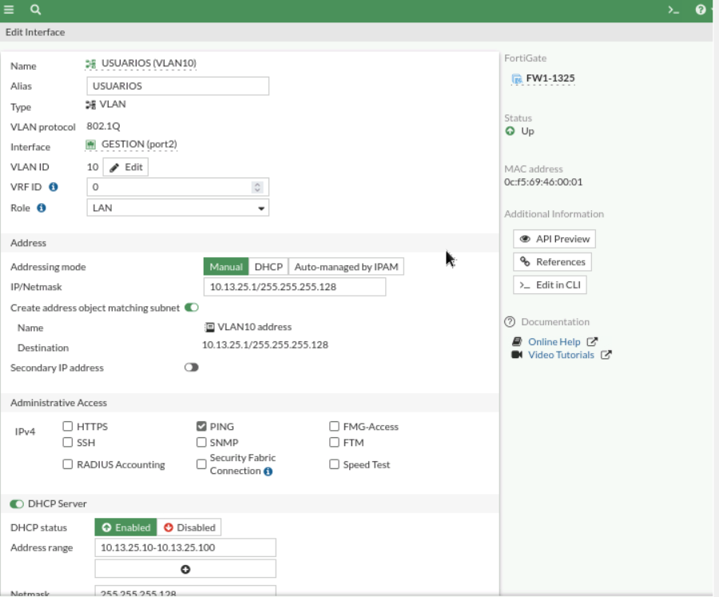

La interfaz del túnel `VPN-SITIO2` la creó el asistente de VPN. No tiene IP porque el tráfico entra en ella por la ruta estática, no por una dirección propia:

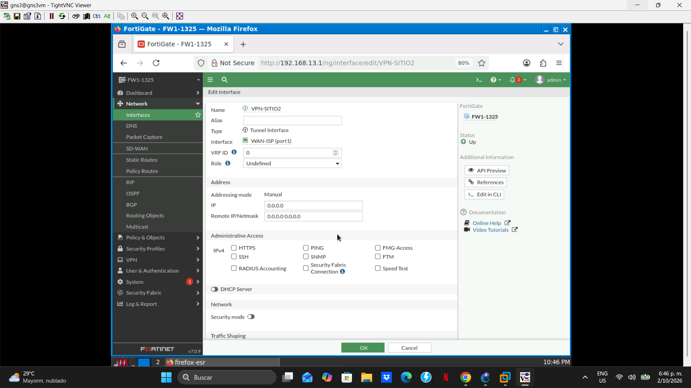

### 6.4 Servidor DHCP en VLAN10 (USUARIOS)

| Campo | Valor |
| --- | --- |
| DHCP status | Enabled |
| Address range | 10.13.25.10 – 10.13.25.100 |
| Netmask | 255.255.255.128 |
| Default gateway | Same as Interface IP (10.13.25.1) |
| DNS server | Specify: 8.8.8.8 y 1.1.1.1 |
| Lease time | 604800 s (7 días) |

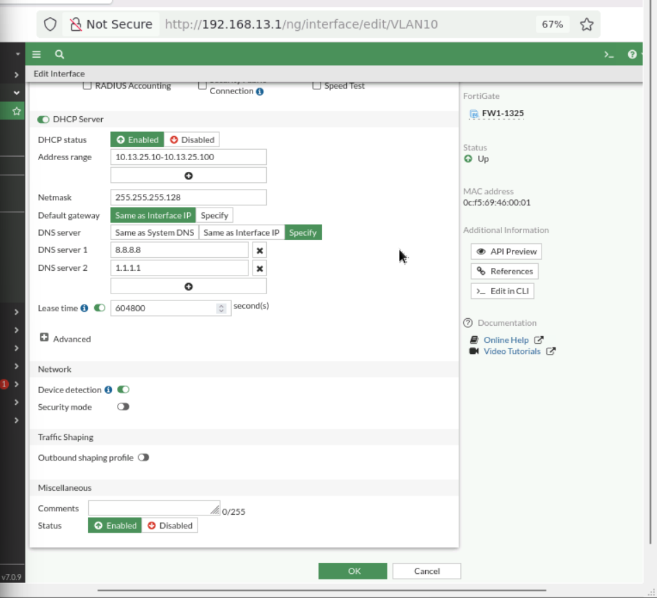

El Usuario recibió la IP `10.13.25.10`:

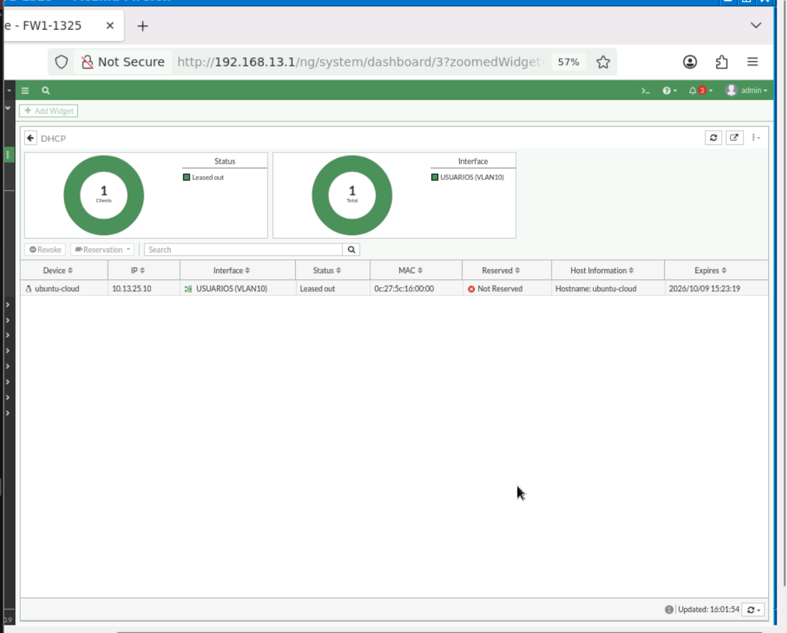

### 6.5 Network → DNS

| DNS servers | Primario | Secundario |
| --- | --- | --- |
| Specify | 8.8.8.8 | 1.1.1.1 |

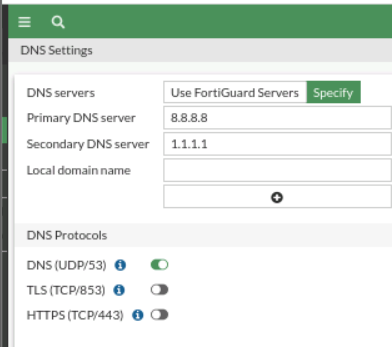

### 6.6 Network → Static Routes

| # | Destino | Gateway | Interfaz | Distancia | Quién la creó |
| --- | --- | --- | --- | --- | --- |
| 1 | 0.0.0.0/0 | 192.168.42.1 | port1 (WAN-ISP) | 10 | Yo, a mano (salida a Internet por NAT1) |
| 2 | VPN-SITIO2_remote (10.13.25.128/28) | — | VPN-SITIO2 (túnel) | 10 | Asistente de VPN |
| 3 | VPN-SITIO2_remote (10.13.25.128/28) | — | Blackhole | 254 | Asistente de VPN |

La ruta **Blackhole** (distancia 254) solo se usa cuando el túnel está caído y su ruta desaparece. En ese caso descarta el tráfico hacia la LAN remota en vez de dejarlo salir sin cifrar por la ruta por defecto.

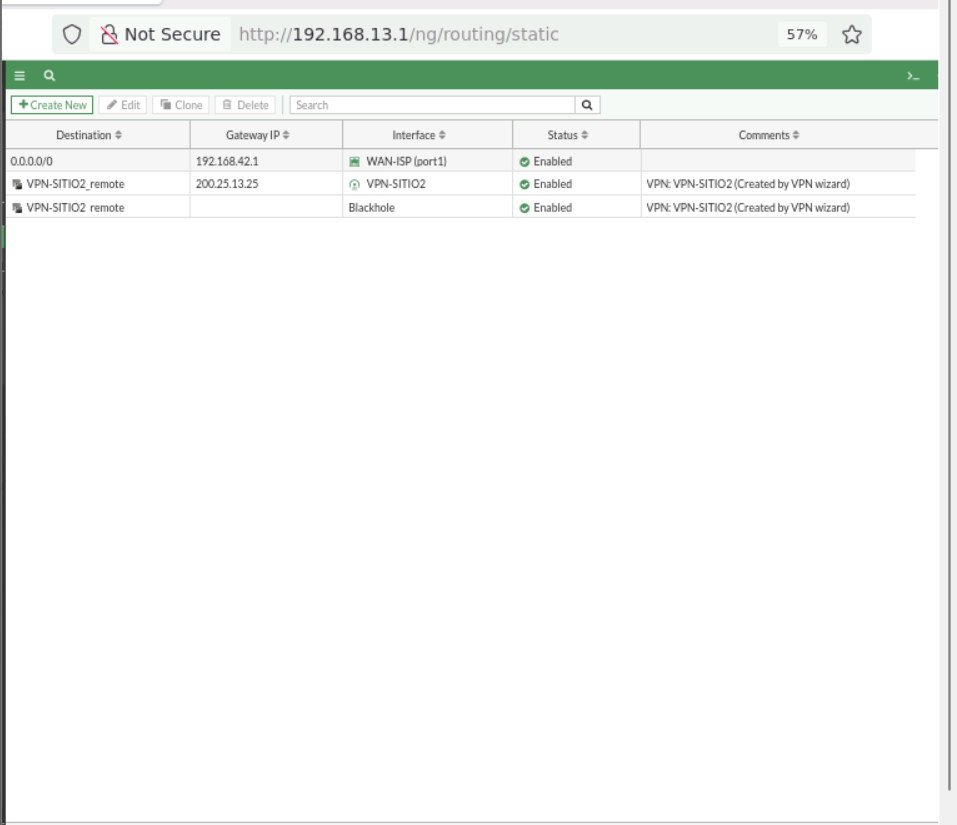

### 6.7 Policy & Objects → Addresses

| Nombre | Tipo | Valor | Quién lo creó |
| --- | --- | --- | --- |
| LAN-USUARIOS | Subnet | 10.13.25.0/25 | Yo, a mano |
| VLAN10 address | Interface Subnet | 10.13.25.0/25 (VLAN10) | Automático al crear la VLAN |
| VPN-SITIO2_local_subnet_1 | Subnet | 10.13.25.0/25 | Asistente de VPN |
| VPN-SITIO2_remote_subnet_1 | Subnet | 10.13.25.128/28 | Asistente de VPN |
| VPN-SITIO2_local | Address Group | VPN-SITIO2_local_subnet_1 | Asistente de VPN |
| VPN-SITIO2_remote | Address Group | VPN-SITIO2_remote_subnet_1 | Asistente de VPN |

Los demás objetos (`all`, `none`, FQDN de Google/Microsoft, `SSLVPN_TUNNEL_ADDR1`, etc.) vienen por defecto en FortiOS.

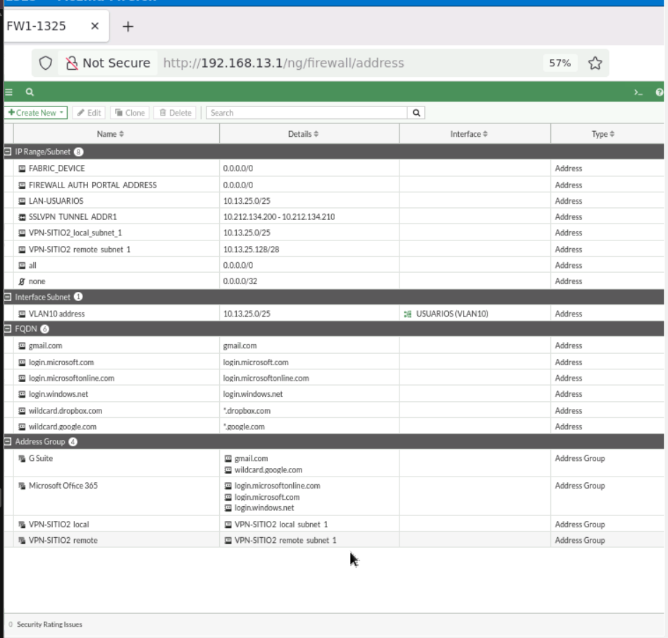

### 6.8 Policy & Objects → Firewall Policy

| # | Nombre | Entrada | Salida | Origen | Destino | Servicio | Acción | NAT | Log |
| --- | --- | --- | --- | --- | --- | --- | --- | --- | --- |
| 1 | USUARIOS-INTERNET | VLAN10 (USUARIOS) | port1 (WAN-ISP) | LAN-USUARIOS | all | ALL | ACCEPT | **Enabled** (IP de la interfaz de salida) | All Sessions |
| 2 | vpn_VPN-SITIO2_local_0 | VLAN10 (USUARIOS) | VPN-SITIO2 | VPN-SITIO2_local | VPN-SITIO2_remote | ALL | ACCEPT | Disabled | Security Events |
| 3 | vpn_VPN-SITIO2_remote_0 | VPN-SITIO2 | VLAN10 (USUARIOS) | VPN-SITIO2_remote | VPN-SITIO2_local | ALL | ACCEPT | Disabled | Security Events |
| — | Implicit Deny | any | any | all | all | ALL | DENY | — | — |

- **NAT:** la política `USUARIOS-INTERNET` la creé a mano. Traduce la IP privada del Usuario (`10.13.25.x`) a la IP de WAN `192.168.42.13` para que pueda salir a Internet (instalar paquetes, `ping 8.8.8.8`).
- **Sin NAT en la VPN:** las dos políticas `vpn_*` las creó el asistente sin NAT, para que las IP internas viajen tal cual dentro del túnel y cada lado vea la IP real del otro.

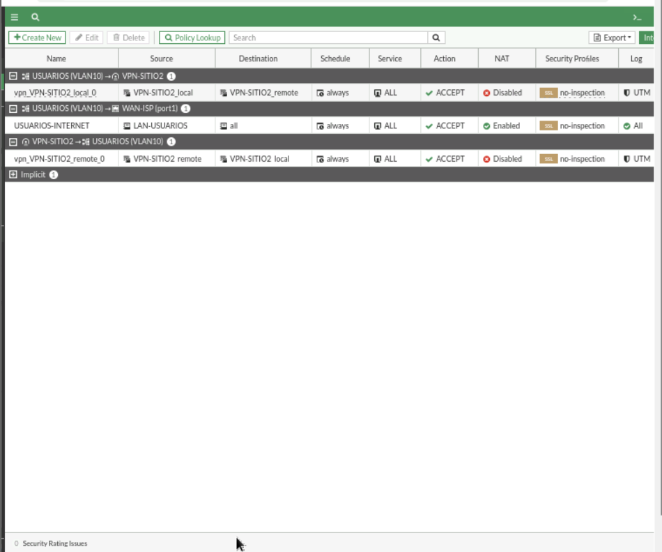

### 6.9 VPN → IPsec Wizard (túnel VPN-SITIO2)

**Datos que puse en el asistente:**

| Pantalla | Campo | Valor |
| --- | --- | --- |
| VPN Setup | Name | `VPN-SITIO2` |
| | Template type | Site to Site |
| | NAT configuration | No NAT between sites |
| | Remote device type | FortiGate |
| Authentication | Remote device | IP Address |
| | Remote IP address | `200.25.13.25` |
| | Outgoing Interface | port1 (WAN-ISP) |
| | Authentication method | Pre-shared Key: `Vpn#20251325` |
| Policy & Routing | Local interface | VLAN10 (USUARIOS) |
| | Local subnets | 10.13.25.0/25 |
| | Remote subnets | 10.13.25.128/28 |
| | Internet Access | None |

**Ajuste que hice después del asistente** (*VPN → IPsec Tunnels → VPN-SITIO2 → Convert To Custom Tunnel → Network*):

| Campo | Valor | Por qué |
| --- | --- | --- |
| Local Gateway | **Secondary IP → 200.25.13.13** | Por defecto el FortiGate negocia IKE desde su IP principal (`192.168.42.13`), y el FW2 espera la IP pública `200.25.13.13` |

**Parámetros finales del túnel:**

| Fase | Parámetro | Valor |
| --- | --- | --- |
| Network | Remote Gateway | Static IP Address `200.25.13.25` por port1 |
| | Local Gateway | `200.25.13.13` |
| | NAT Traversal | Enable |
| | Keepalive Frequency | 10 s |
| | Dead Peer Detection | On Demand (3 reintentos cada 20 s) |
| Authentication | Método | Pre-shared Key |
| | IKE | Versión 1, modo Main (ID protection) |
| Fase 1 | Proposal | **DES-MD5, DES-SHA1** |
| | Diffie-Hellman | Grupos 14 y 5 |
| | XAUTH | Disabled |
| Fase 2 | Selector | `VPN-SITIO2`: VPN-SITIO2_local ↔ VPN-SITIO2_remote |
| | Proposal | **DES-MD5, DES-SHA1** |
| | Replay Detection | Activado |
| | PFS | Activado, grupos 14 y 5 |
| | Key Lifetime | 43200 s |
| | Auto-negotiate | Desactivado (el túnel sube cuando llega tráfico) |

> ⚠️ **Sobre el cifrado DES:** la licencia de evaluación de FortiOS 7.0.9 solo permite cifrado de baja seguridad (DES). En un entorno real usaría AES-256 con SHA-256 o superior. El asistente eligió automáticamente DES-MD5 y DES-SHA1.

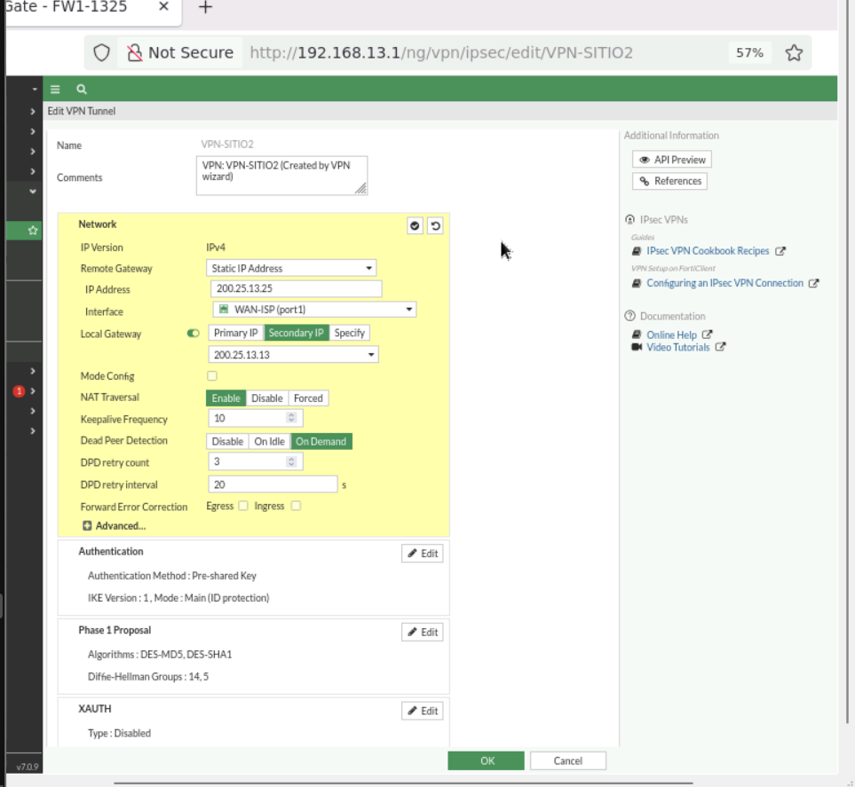
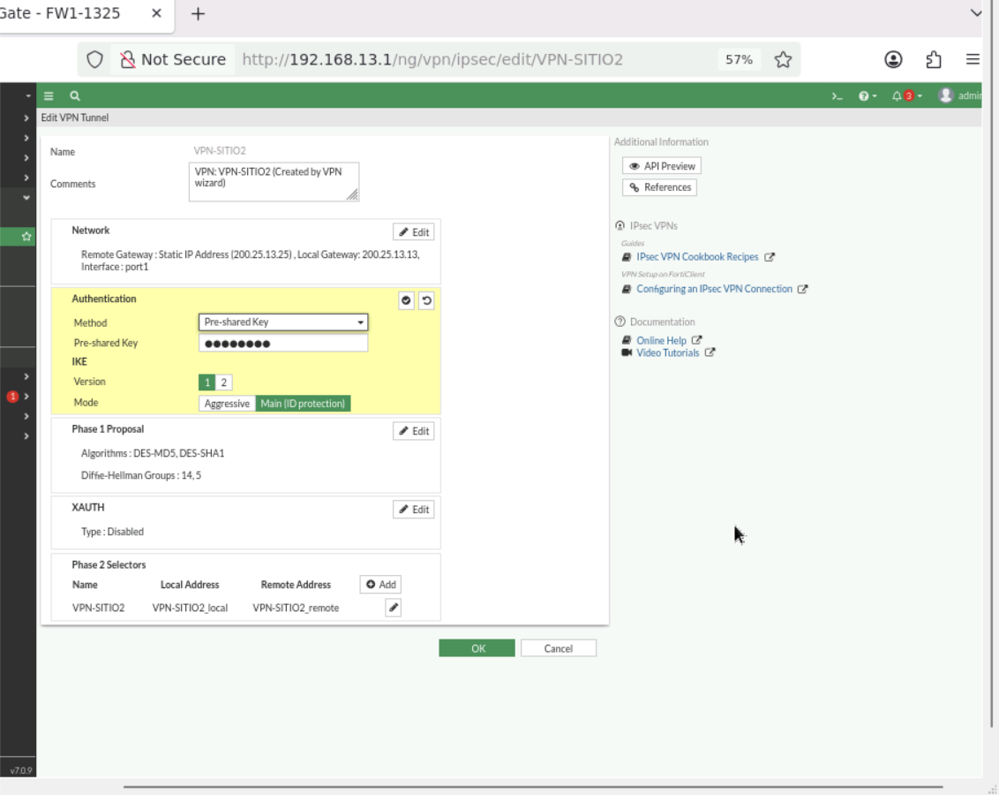
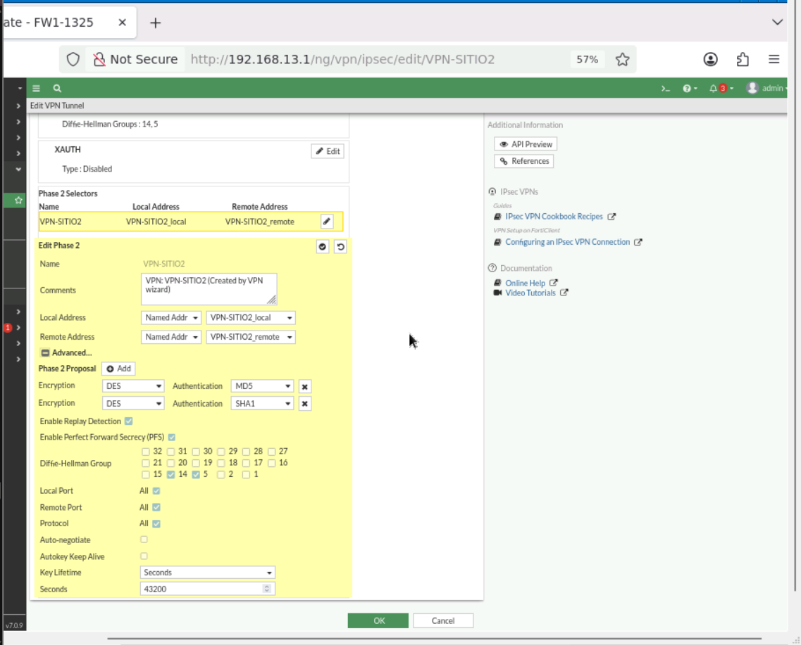

### 6.10 Estado del túnel en el FW1

En *Dashboard → Network → IPsec* el túnel `VPN-SITIO2` aparece **Up** (Fase 1 y Fase 2 en verde), con Remote Gateway `200.25.13.25` y tráfico de entrada y salida:

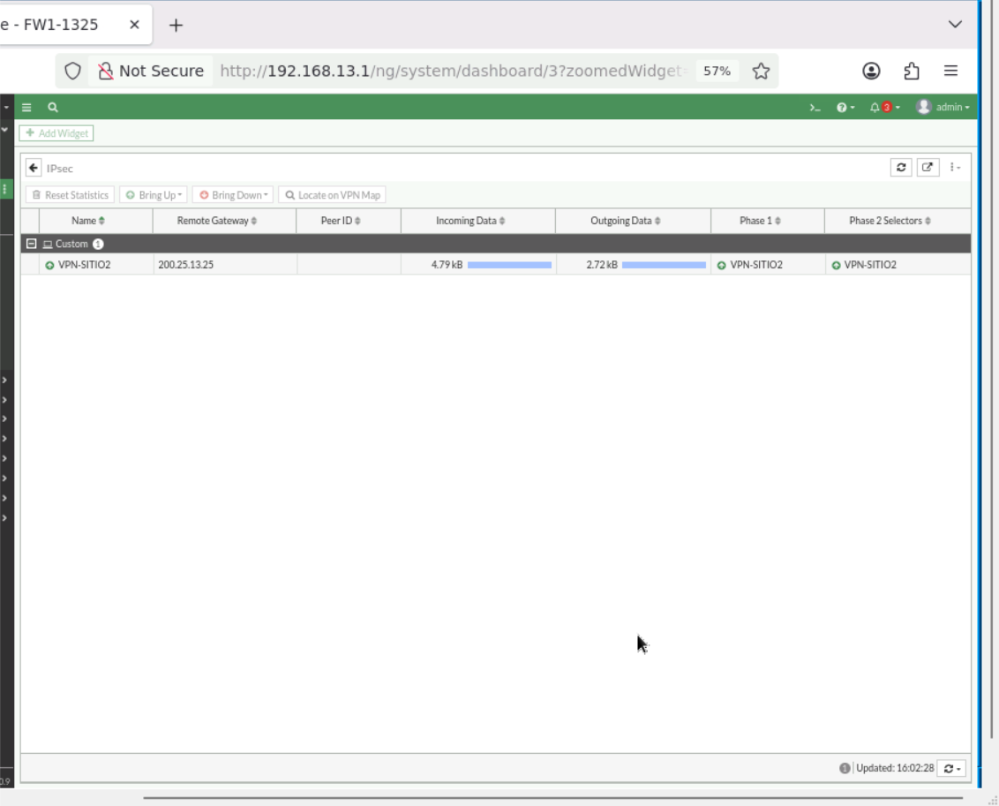

---

## 7. FortiGate 2 (FMW2-1325)

> 📝 **Nota:** toda la configuración de esta sección la hice **de forma gráfica (GUI)** desde el Firefox del webterm-2, entrando a `http://192.168.25.1`. El único paso por CLI fue darle la IP inicial a `port2`. El running-config completo en texto está en [`running-configs/FMW2-1325.conf`](VPN-Infraestructura-1-FortiGate-FortiGate/running-configs/FMW2-1325.conf).

### 7.1 Arranque inicial por CLI

```
config system interface
    edit "port2"
        set mode static
        set ip 192.168.25.1 255.255.255.0
        set allowaccess ping https http
    next
end
```

### 7.2 System → Settings

| Campo | Valor |
| --- | --- |
| Hostname | `FMW2-1325` |
| Time zone | GMT-4 (Santo Domingo) |

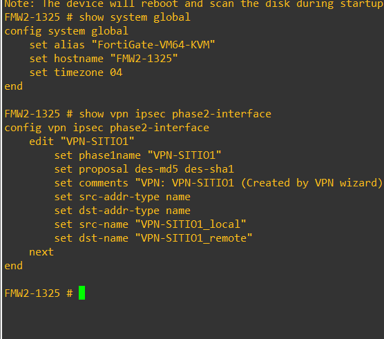

### 7.3 Network → Interfaces

| Interfaz | Alias | Tipo | Rol | IP principal | IP secundaria | Administrative Access |
| --- | --- | --- | --- | --- | --- | --- |
| port1 | WAN-ISP | Física | Undefined | 192.168.42.25/24 | 200.25.13.25/27 (PING) | PING |
| port2 | LAN-SITIO2 | Física | LAN | 192.168.25.1/24 | 10.13.25.129/28 (PING) | PING, HTTPS, HTTP |
| VPN-SITIO1 | — | Túnel (la creó el asistente) | — | 0.0.0.0 (sin IP) | — | ninguno |

- El Sitio 2 no usa VLAN. En `port2` la IP principal `192.168.25.1` es para la gestión (webterm-2), y la secundaria `10.13.25.129` es el gateway del Servidor Web.
- El FW2 no tiene servidor DHCP, porque el servidor usa IP fija.


### 7.4 Network → DNS

| DNS servers | Primario | Secundario |
| --- | --- | --- |
| Specify | 8.8.8.8 | 1.1.1.1 |


Los servidores de FortiGuard aparecen como *Unreachable* porque la VM de evaluación no tiene licencia de FortiGuard. No afecta a la práctica.

### 7.5 Network → Static Routes

| # | Destino | Gateway | Interfaz | Distancia | Quién la creó |
| --- | --- | --- | --- | --- | --- |
| 1 | 0.0.0.0/0 | 192.168.42.1 | port1 (WAN-ISP) | 10 | Yo, a mano |
| 2 | VPN-SITIO1_remote (10.13.25.0/25) | — | VPN-SITIO1 (túnel) | 10 | Asistente de VPN |
| 3 | VPN-SITIO1_remote (10.13.25.0/25) | — | Blackhole | 254 | Asistente de VPN |

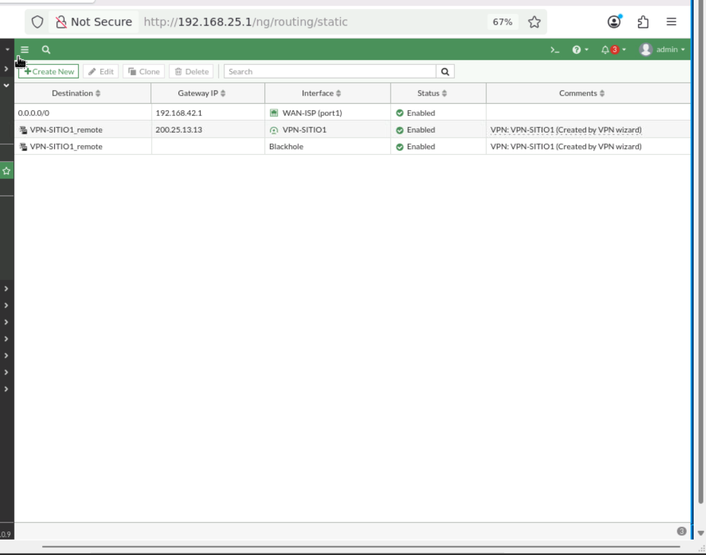

### 7.6 Policy & Objects → Addresses

| Nombre | Tipo | Valor | Quién lo creó |
| --- | --- | --- | --- |
| LAN-SERVIDOR | Subnet | 10.13.25.128/28 | Yo, a mano |
| VPN-SITIO1_local_subnet_1 | Subnet | 10.13.25.128/28 | Asistente de VPN |
| VPN-SITIO1_remote_subnet_1 | Subnet | 10.13.25.0/25 | Asistente de VPN |
| VPN-SITIO1_local | Address Group | VPN-SITIO1_local_subnet_1 | Asistente de VPN |
| VPN-SITIO1_remote | Address Group | VPN-SITIO1_remote_subnet_1 | Asistente de VPN |

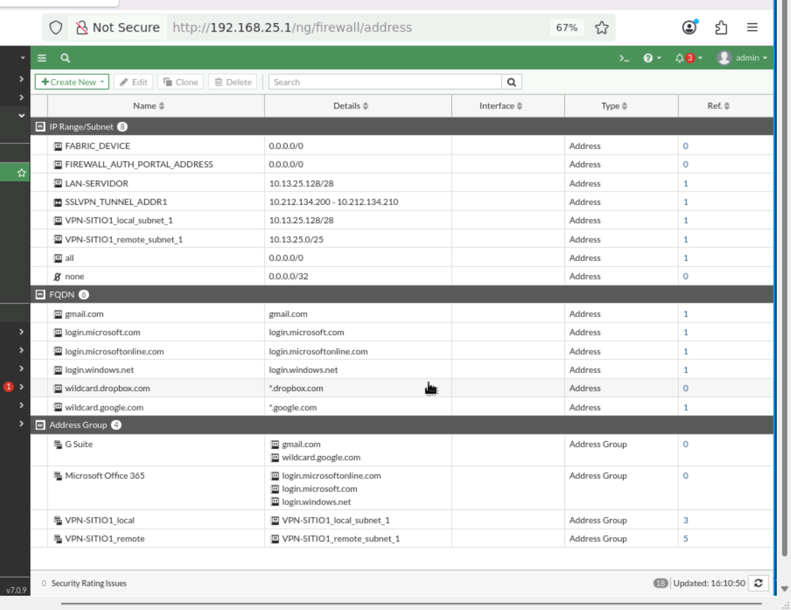

### 7.7 Policy & Objects → Firewall Policy

| # | Nombre | Entrada | Salida | Origen | Destino | Servicio | Acción | NAT | Log |
| --- | --- | --- | --- | --- | --- | --- | --- | --- | --- |
| 1 | SERVIDOR-INTERNET | port2 (LAN-SITIO2) | port1 (WAN-ISP) | LAN-SERVIDOR | all | ALL | ACCEPT | **Enabled** (IP de la interfaz de salida) | All Sessions |
| 2 | vpn_VPN-SITIO1_local_0 | port2 (LAN-SITIO2) | VPN-SITIO1 | VPN-SITIO1_local | VPN-SITIO1_remote | ALL | ACCEPT | Disabled | Security Events |
| 3 | vpn_VPN-SITIO1_remote_0 | VPN-SITIO1 | port2 (LAN-SITIO2) | VPN-SITIO1_remote | VPN-SITIO1_local | ALL | ACCEPT | Disabled | Security Events |
| — | Implicit Deny | any | any | all | all | ALL | DENY | — | — |

- **NAT:** con `SERVIDOR-INTERNET` el Servidor Web sale a Internet traducido a `192.168.42.25`. La usé para instalar Apache.
- Las políticas de la VPN las creó el asistente y no hacen NAT.


### 7.8 VPN → IPsec Wizard (túnel VPN-SITIO1)

| Pantalla | Campo | Valor |
| --- | --- | --- |
| VPN Setup | Name | `VPN-SITIO1` |
| | Template type | Site to Site |
| | NAT configuration | No NAT between sites |
| | Remote device type | FortiGate |
| Authentication | Remote device | IP Address |
| | Remote IP address | `200.25.13.13` |
| | Outgoing Interface | port1 (WAN-ISP) |
| | Authentication method | Pre-shared Key: `Vpn#20251325` |
| Policy & Routing | Local interface | port2 (LAN-SITIO2) |
| | Local subnets | **10.13.25.128/28**. Borré la `192.168.25.0/24` que el asistente puso automáticamente |
| | Remote subnets | 10.13.25.0/25 |
| | Internet Access | None |

**Ajuste que hice después del asistente** (*Convert To Custom Tunnel → Network*): **Local Gateway → Secondary IP → 200.25.13.25**.

Los parámetros de Fase 1 y Fase 2 son **idénticos a los del FW1** (sección 6.9): IKEv1 en modo Main, DES-MD5/DES-SHA1, DH 14 y 5, PFS activado y Key Lifetime de 43200 s. Las dos puntas deben coincidir para que el túnel negocie.

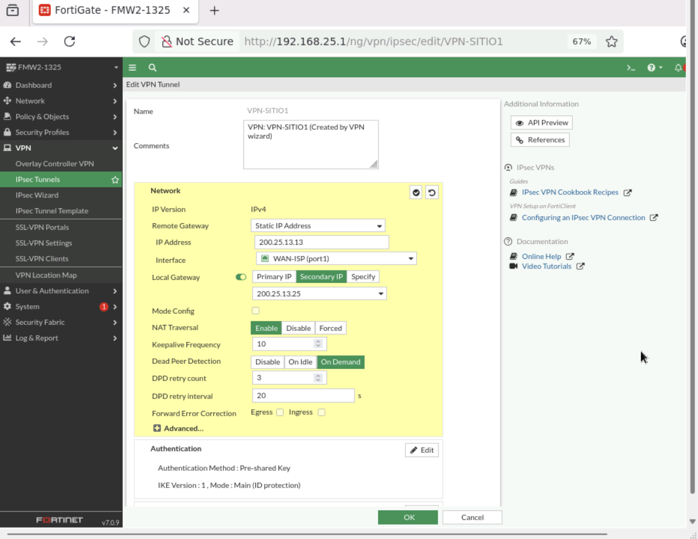
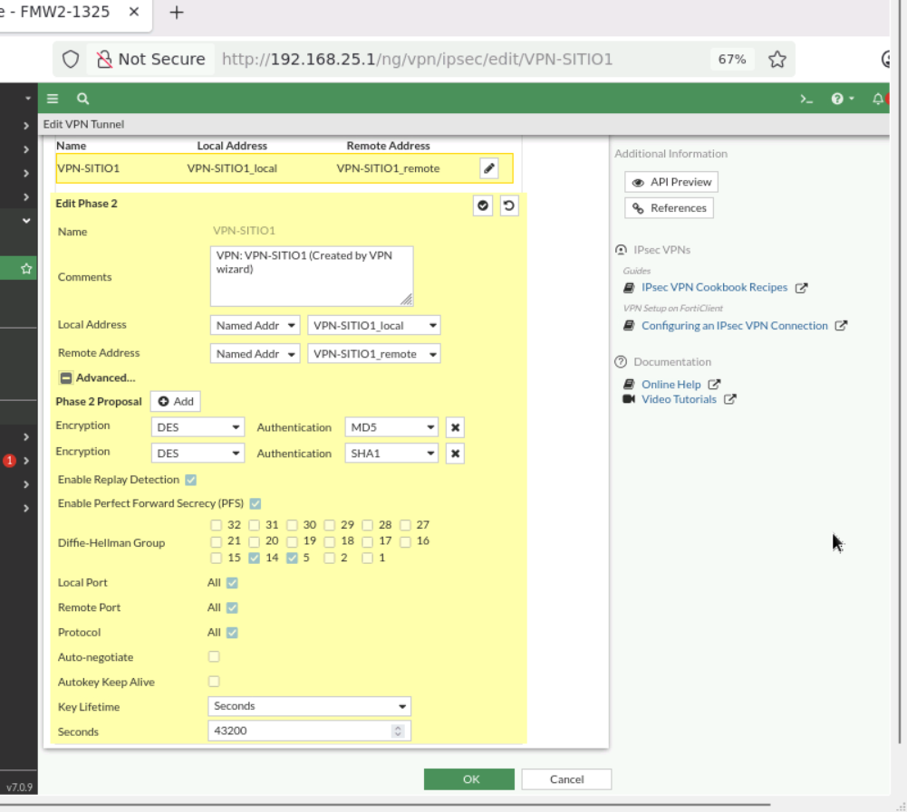

### 7.9 Estado del túnel en el FW2

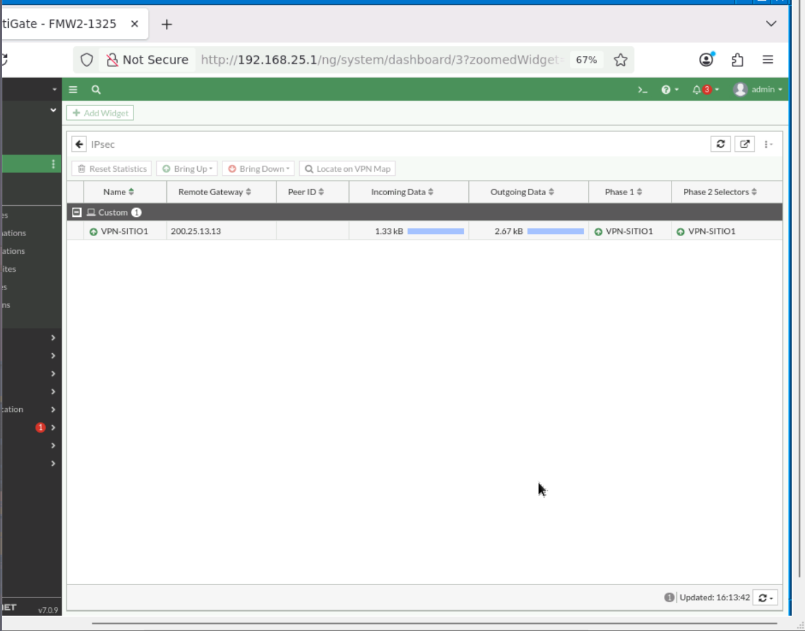

El túnel `VPN-SITIO1` aparece **Up**, con Remote Gateway `200.25.13.13`.

---

## 8. Webterms de gestión

Usé los webterm (contenedor Docker con Firefox) **solo para entrar a la GUI de los FortiGate**. La imagen trae toda la configuración de red comentada, así que la configuré en GNS3 con **clic derecho → Edit config**, con el nodo apagado.

| Nodo | IP | Gateway | Para qué |
| --- | --- | --- | --- |
| webterm-1 | 192.168.13.2/24 | 192.168.13.1 | GUI del FW1 (VLAN 99 nativa) |
| webterm-2 | 192.168.25.2/24 | 192.168.25.1 | GUI del FW2 |

```
auto eth0
iface eth0 inet static
	address 192.168.13.2
	netmask 255.255.255.0
	gateway 192.168.13.1
```

Los archivos completos están en [`scripts/hosts/`](VPN-Infraestructura-1-FortiGate-FortiGate/scripts/hosts/).

---

## 9. Usuario

**Imagen:** Ubuntu Cloud 24.04 (credenciales `ubuntu` / `ubuntu`).

El Usuario usa DHCP en `ens3` (la imagen ya lo trae activado). El switch SW1 lo pone en la VLAN 10 y el FW1 le entregó la IP `10.13.25.10/25`, con gateway `10.13.25.1` y DNS 8.8.8.8 / 1.1.1.1.

```bash
ip a show ens3          # 10.13.25.10/25
ip route                # default via 10.13.25.1
ping -c 4 8.8.8.8       # Internet a través del NAT del FW1
sudo apt update
sudo apt install -y traceroute
```

---

## 10. Servidor Web

**Imagen:** Ubuntu Cloud 24.04, hostname `WEBSERVER-1325`.

### 10.1 IP fija con netplan

Primero desactivé la configuración de red de cloud-init para que no sobrescribiera la IP fija:

```bash
sudo -i
echo 'network: {config: disabled}' > /etc/cloud/cloud.cfg.d/99-disable-network-config.cfg
nano /etc/netplan/50-cloud-init.yaml
```

```yaml
network:
  version: 2
  ethernets:
    ens3:
      dhcp4: false
      addresses: [10.13.25.130/28]
      mtu: 1400
      routes:
        - to: default
          via: 10.13.25.129
      nameservers:
        addresses: [8.8.8.8, 1.1.1.1]
```

```bash
chmod 600 /etc/netplan/50-cloud-init.yaml
netplan apply
```

Puse `mtu: 1400` para dejar espacio a las cabeceras que añade IPsec. Así evito que los paquetes grandes del HTTPS se fragmenten o se pierdan dentro del túnel.

### 10.2 Apache con HTTPS

```bash
apt update
apt install -y apache2
a2enmod ssl
a2ensite default-ssl
systemctl restart apache2
echo '<h1>Servidor Web - Sitio 2 - Omar Paulino 20251325</h1>' > /var/www/html/index.html
```

El sitio `default-ssl` usa el certificado autofirmado (*snakeoil*) que Ubuntu genera al instalar Apache. Está emitido a nombre del hostname, no de la IP, por eso `curl` necesita la opción `-k` para aceptarlo.


### 10.3 Verificación en el servidor

```bash
ip a show ens3            # 10.13.25.130/28, mtu 1400
ss -tlnp | grep 443       # apache2 escuchando en *:443
curl -k https://localhost # devuelve la página
```


---

## 11. Pruebas y resultados

Los comandos de prueba están en [`scripts/hosts/pruebas_usuario.sh`](VPN-Infraestructura-1-FortiGate-FortiGate/scripts/hosts/pruebas_usuario.sh). La demostración completa, incluida la prueba con la VPN caída, está en el [video](#video-de-demostración).

### 11.1 Con la VPN arriba (desde el Usuario)

```bash
ping -c 4 10.13.25.130
traceroute 10.13.25.130
curl -k https://10.13.25.130
```

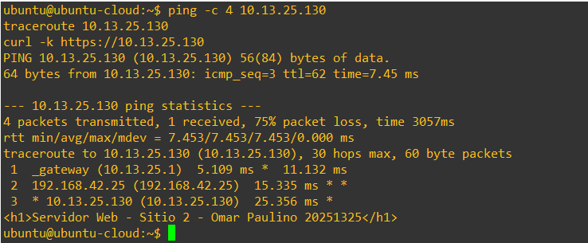

| Prueba | Resultado |
| --- | --- |
| Estado del túnel | **Up** en los dos FortiGate (FW1 ve `200.25.13.25`, FW2 ve `200.25.13.13`) |
| ping 10.13.25.130 | Responde con TTL 62 (dos saltos de router: FW1 y FW2). En esta captura se perdieron paquetes porque la RAM de mi laptop estaba al 98% (ver sección 12) |
| traceroute | 3 saltos: `10.13.25.1` (FW1) → `192.168.42.25` (FW2) → `10.13.25.130` (WebServer) |
| curl -k https | Devuelve `<h1>Servidor Web - Sitio 2 - Omar Paulino 20251325</h1>` |

**Lectura del traceroute:**

- El salto 2 aparece como `192.168.42.25` porque el FW2 responde el ICMP con la IP principal de su WAN; la interfaz del túnel no tiene IP propia.
- Que sean solo 3 saltos, sin pasar por el gateway de NAT1 (`192.168.42.1`), demuestra que el tráfico va directo de FortiGate a FortiGate por dentro del túnel.

### 11.2 Con la VPN abajo

Para tumbar la VPN deshabilité la interfaz del túnel en el FW1: *Network → Interfaces → port1 → VPN-SITIO2 → Status: Disabled*. Por CLI es lo mismo:

```
config system interface
    edit "VPN-SITIO2"
        set status down
    next
end
```

> Al principio usé *Dashboard → Network → IPsec → Bring Down*, pero el túnel se volvía a levantar solo en cuanto el Usuario hacía un `curl`. El túnel se negocia **bajo demanda**: mientras exista la ruta hacia la LAN remota, cualquier tráfico interesante dispara una nueva negociación IKE. Con la interfaz deshabilitada la ruta del túnel desaparece y el túnel se queda abajo.

| Prueba | Resultado esperado |
| --- | --- |
| ping 10.13.25.130 | 100% de pérdida |
| traceroute 10.13.25.130 | Solo responde `10.13.25.1`, luego `* * *` (la ruta Blackhole descarta el tráfico) |
| curl -k https://10.13.25.130 | Se queda esperando hasta dar *timeout* |
| ping 8.8.8.8 | Sigue respondiendo (Internet funciona por la política NAT) |

Al volver a poner la interfaz en *Enabled* (`set status up`), el primer `curl` dispara la negociación del túnel y todas las pruebas funcionan otra vez. **Conclusión:** la única vía entre el Usuario y el Servidor Web es el túnel IPsec.


        └── pruebas_usuario.sh
```
